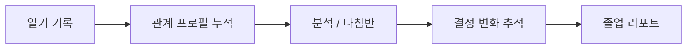
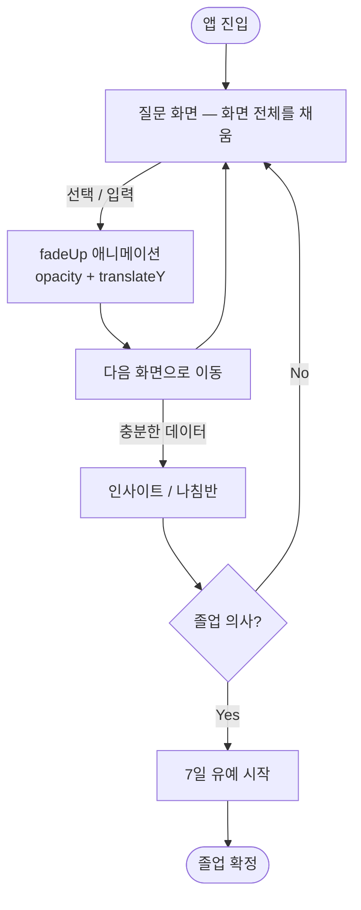

# Product Principles

## 제품 목표
- 헤어진 연인 마음 정리 앱
- 최종 성공 지표: 사용자가 감정을 정리하고 앱을 떠나는 것(졸업)
- 졸업은 즉시 불가, 반드시 7일 유예 적용

## 핵심 데이터 흐름

## UX 흐름

## UX 원칙
- 채팅 UI 금지, 화면 단위 질문-응답 전환 구조 유지
- 질문은 화면을 채우고, 선택/입력 후 다음 화면으로 이동
- fadeUp 애니메이션 사용 (opacity + translateY)

## 유기적 연결 원칙
- 한 트랙에서 답한 내용은 다른 트랙에도 반영
- 이전 답변 재노출 시 "저번에 이렇게 말했는데" 프레임 사용
- 답변이 바뀌면 변화 사실을 자연스럽게 언급
- 장단점은 한 화면에서 동시에 보도록 구성

## 말투 원칙
- 단정/강요 금지 ("해야 해" 금지)
- 감정 인정 → 이성적 전환
- 짧고 따뜻한 문장
- 최종 결정은 항상 사용자에게 귀속
