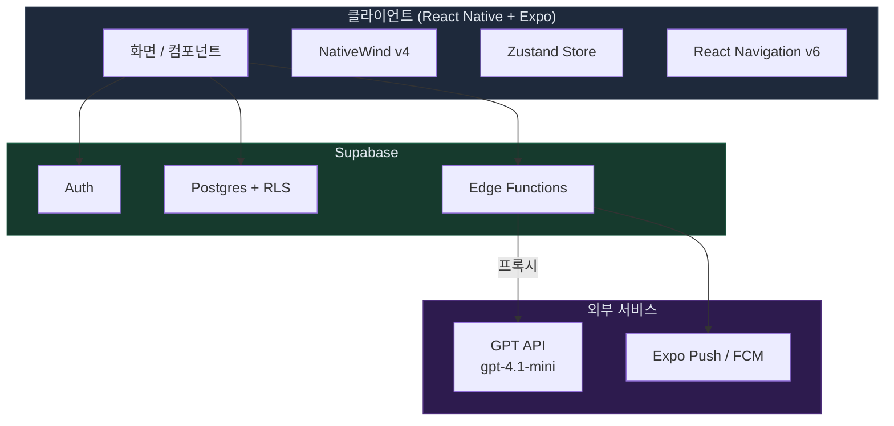

# Tech And Architecture

## 시스템 아키텍처

> **GPT API는 반드시 Edge Function을 통해서만 호출. 클라이언트 직접 호출 금지.**

## 프론트엔드
- React Native + Expo (SDK 51+)
- NativeWind v4
- Zustand
- React Navigation v6
- expo-notifications
- react-native-chart-kit
- AsyncStorage
- TypeScript strict

## 백엔드
- Supabase (Auth + Postgres + Edge Functions)
- GPT API는 Edge Function에서만 호출
- Push: Expo Push / FCM

## 보안 원칙
- 클라이언트에서 GPT API 직접 호출 금지
- `OPENAI_API_KEY`는 Edge Function 환경변수로만 보관
- 모든 테이블 RLS 필수 (`user_id` 기준)
- DB 변경은 `supabase/migrations/` SQL로 관리
