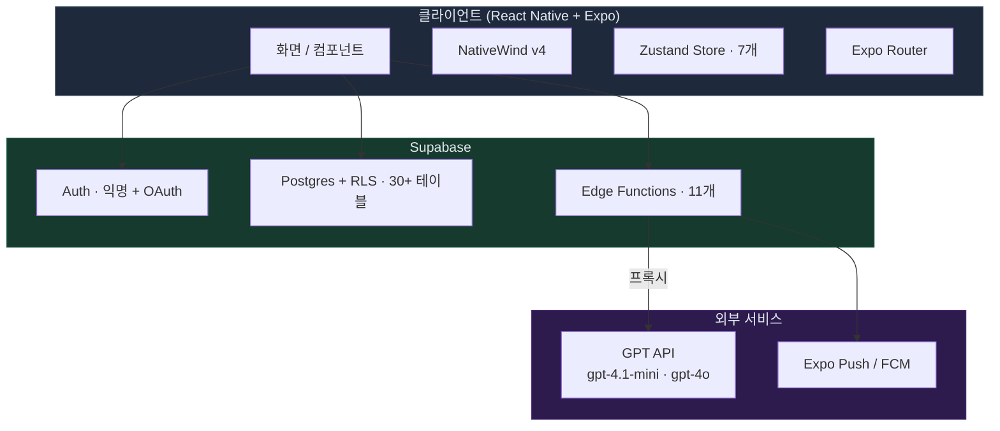

# Tech And Architecture

## 시스템 아키텍처

> **GPT API는 반드시 Edge Function을 통해서만 호출. 클라이언트 직접 호출 금지.**

## 프론트엔드
- React Native + Expo (SDK 54+)
- iOS bare workflow — Expo prebuild 적용 (`ios/` 디렉터리, Podfile, `.xcodeproj` 포함)
- NativeWind v4
- Zustand (7개 스토어: User · Journal · Question · Relationship · Decision · Cooling · **Persona**)
- Expo Router (파일 기반 라우팅)
- expo-notifications
- react-native-chart-kit
- AsyncStorage
- TypeScript strict

## 백엔드
- Supabase (Auth + Postgres + Edge Functions)
- 마이그레이션: 001~031 (현재 적용된 SQL 파일 30+개)
- Edge Functions 11개:
  - AI 응답 6개: `ai-journal-response` · `ai-journal-response-stream` · `ai-comfort` · `ai-daily-quote` · `ai-graduation-letter` · `cooling-checkin-response` · `graduation-farewell-response`
  - 운영 4개: `account-delete` · `persona-reclassify-cron` · `push-cooling-day7` · `push-daily-reminder`
- AI 모델: 기본 `gpt-4.1-mini`, 졸업 편지만 `gpt-4o`
- Push: Expo Push / FCM

## 보안 원칙
- 클라이언트에서 GPT API 직접 호출 금지
- `OPENAI_API_KEY`는 Edge Function 환경변수로만 보관
- 모든 테이블 RLS 필수 (`user_id` 기준)
- DB 변경은 `supabase/migrations/` SQL로 관리
- 처리정지권 (PIPA §37) — `processing_suspension` 토글로 알림·AI 분석 클라/서버 dual gate
