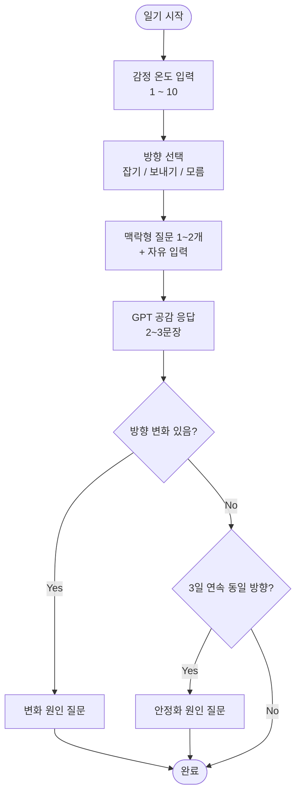
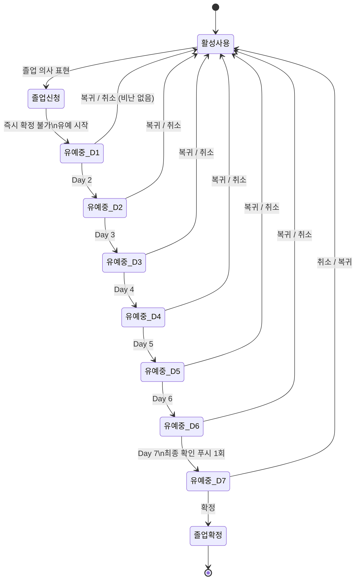

# Journal And Cooling Policy

## 일기 기록 흐름

## 졸업 유예 상태 머신

## 알림 정책 (유예기간)

```mermaid
gantt
  title 유예기간 알림 타임라인
  dateFormat  D
  axisFormat Day %d

  section 알림 없음
  무알림 구간 : 1, 6d

  section Day 7
  최종 확인 푸시 1회 : 7, 1d
```

## 이별 일기 (핵심 루틴)
- 감정 온도(1~10)
- 방향 선택(잡기/보내기/모름)
- 맥락형 질문 1~2개 + 자유 입력
- GPT 공감 응답(2~3문장)

## 졸업 유예기간 (7일)
- 졸업 신청 즉시 확정 불가
- Day 1~6: 푸시 알림 없음 (감정 자극 최소화)
- Day 7: 최종 확인 푸시 알림 1회
- 유예 중 흔들림/복귀 의사는 항상 비난 없이 허용

## 체크인 정책
- 유예 중 체크인은 자율 진입 기준
- 체크인 입력: 감정 온도 + 졸업 의지
- 최종 Day 7에서 확정/리셋/취소 결정
