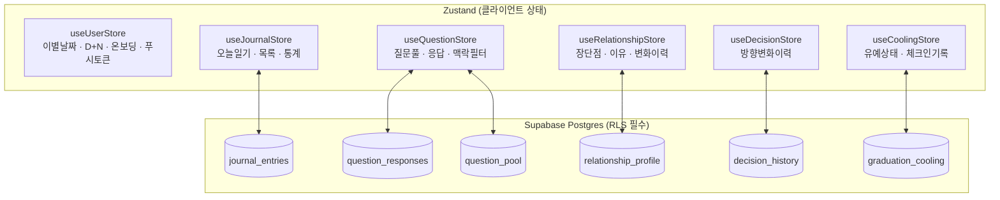
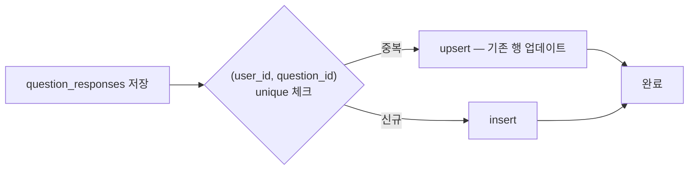

# Data And State

## 상태 레이어 구조

## DB 정합성 규칙

## 핵심 저장소 (Zustand)
- `useUserStore`: 이별 날짜, D+N, 온보딩, 푸시 토큰
- `useJournalStore`: 오늘 일기, 목록, 통계
- `useQuestionStore`: 질문 풀, 응답, 맥락 필터
- `useRelationshipStore`: 장점/단점/이유 누적, 변화 이력
- `useDecisionStore`: 방향 변화 이력
- `useCoolingStore`: 유예 상태, 체크인 기록

## DB 핵심 테이블
- `journal_entries`
- `question_responses`
- `relationship_profile`
- `decision_history`
- `graduation_cooling`
- `question_pool`

## 정합성 필수 규칙
- `question_responses`: `(user_id, question_id)` unique + upsert
- direction/status enum 전역 통일
- 유예 리셋/취소 시 체크인 데이터 보존 정책 명시
