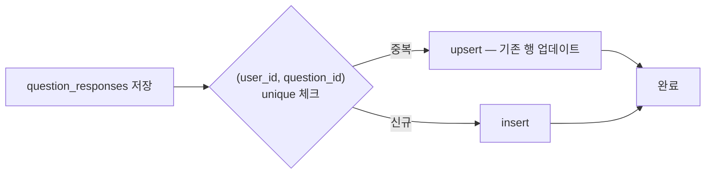

# Data And State

## 상태 레이어 구조

```mermaid
graph TD
  subgraph Zustand["Zustand (클라이언트 상태) · 7개"]
    US[useUserStore\n이별날짜 · D+N · 동의 · 푸시토큰]
    JS[useJournalStore\n오늘일기 · 목록 · 7일 통계]
    QS[useQuestionStore\n질문풀 · 응답 · 노출상태]
    RS[useRelationshipStore\n장단점 · 이유 · 시점별 추이]
    DS[useDecisionStore\n나침반 verdict 히스토리]
    CS[useCoolingStore\n유예상태 · 체크인 · 푸시카운트]
    PS[usePersonaStore\n주/부 페르소나 · 추정시각]
  end

  subgraph DB["Supabase Postgres (RLS 필수)"]
    JE[(journal_entries)]
    QR[(question_responses)]
    RP[(relationship_profile)]
    DH[(decision_history)]
    GC[(graduation_cooling)]
    QP[(question_pool)]
    PE[(personas)]
    PA[(psych_profile_axes)]
    PSA[(psych_assessments)]
    CU[(contact_urges)]
    IM[(intrusive_memory_response)]
    ML[(memory_log)]
    CR[(crisis_assessments)]
    SL[(safety_lockouts)]
    SR[(self_reflections)]
    CO[(cooling_reflections)]
    EV[(events · 텔레메트리)]
  end

  JS <--> JE
  QS <--> QR
  QS <--> QP
  RS <--> RP
  DS <--> DH
  CS <--> GC
  CS <--> CO
  PS <--> PE
  PS <--> PA
```

## DB 정합성 규칙

## Zustand 7개 스토어
- `useUserStore`: userId · 이별날짜 · D+N · 동의 버전 · 푸시 토큰 · 관계기간
- `useJournalStore`: 오늘 일기 · 최근 30개 · 7일 기분 추이 · 방향 히스토리
- `useQuestionStore`: 전체 질문 풀 · 답변·노출 상태 (질문ID별)
- `useRelationshipStore`: 장단점 / 이별 이유 / 고정도·외도·역할 점수 · 시점별 추이
- `useDecisionStore`: 나침반 verdict (8종) 히스토리 + 최신값
- `useCoolingStore`: 유예 id · status · 타이머 · 체크인 응답 · 푸시 카운트
- `usePersonaStore`: 주(primary)·부(secondary) 페르소나 · 추정 시각 — **라벨 비노출 강제**

## DB 핵심 테이블 (현재 30+개)

### 코어
- `users` · `journal_entries` · `question_pool` · `question_responses`
- `relationship_profile` · `decision_history` · `graduation_cooling`

### 페르소나·심리 검사
- `personas` · `psych_profile_axes` (8축 시계열)
- `psych_assessments` (PHQ-9 / GAD-7 / RSE)

### 안전·위기
- `crisis_assessments` (C-SSRS 응답)
- `safety_lockouts` (결정 트랙 잠금)
- `intrusive_memory_response` (떠올림 + 진정)
- `contact_urges` (자가 보고 카운터)

### 회복·정리
- `self_reflections` (about-me 14 카테고리)
- `cooling_reflections` (Day 5/6 학습·미래 계획)
- `memory_log` (추억 정리 자유 입력)

### 법·운영
- `events` (텔레메트리, 옵트인)
- `users.consent_versions` · `consent_accepted_at` (PIPA)
- `users.notifications_suspended` · `ai_analysis_suspended` (PIPA §37)

## 정합성 필수 규칙
- `question_responses`: `(user_id, question_id)` unique + upsert
- `journal_entries`: KST 기준 오늘 1건 unique (raw-mode는 일 2회 허용)
- direction / status / verdict enum 전역 통일
- 유예 리셋/취소 시 체크인 데이터 보존 정책 명시
- 모든 RLS는 `user_id = auth.uid()` 기준
