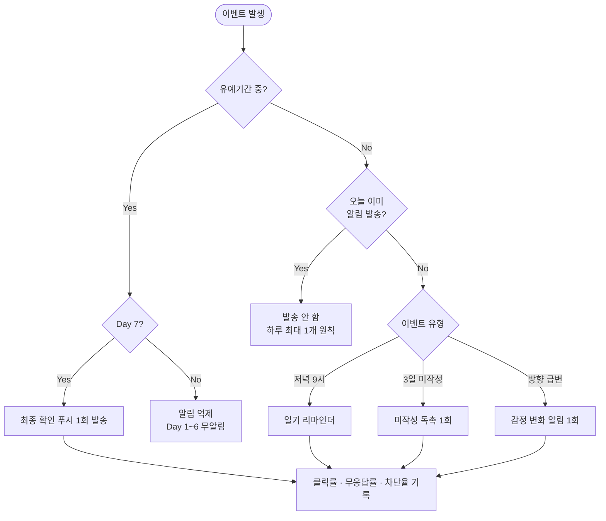

# Notification Policy

## 알림 발송 결정 트리

## 기본 알림
- 일기 리마인더: 매일 저녁 9시 (사용자 설정 가능)
- 미작성 독촉: 3일 미작성 시 1회
- 감정 큰 변화: 방향 급변 시 1회

## 유예기간 알림 (중요)
- Day 1~6: 알림 없음
- Day 7: 최종 확인 알림 1회
- 유예기간 중 일반 알림(리마인더/감정변화) 일시 중지

## 과다 발송 방지
- 하루 최대 1개 원칙
- 알림 피로 지표(클릭률/무응답률/차단율) 기반 튜닝
