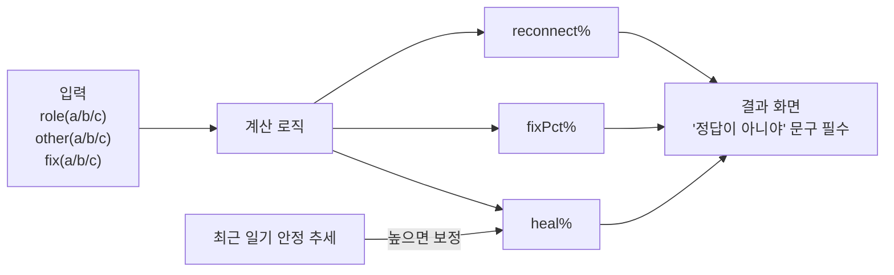
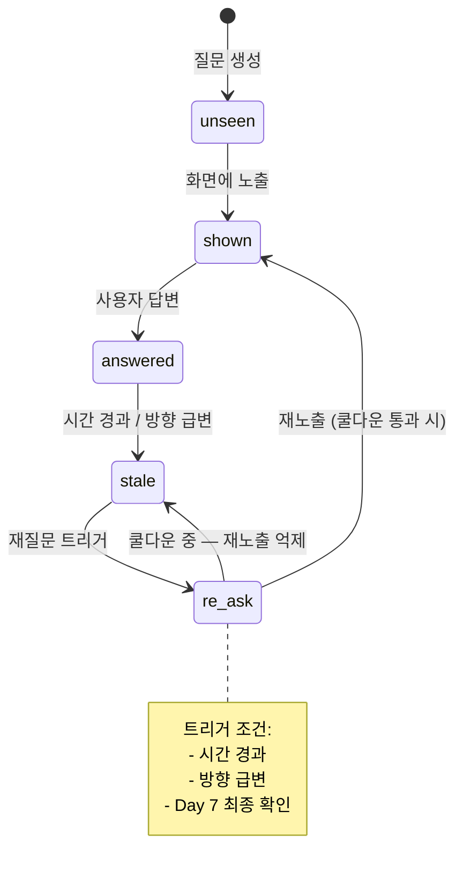

# Logic Rules

## 가망 진단 계산



## 나침반 Verdict (8종)

`store/useDecisionStore.ts:CompassVerdict` 타입.

| Verdict | 조건 (요지) | 의미 |
|---|---|---|
| `strong_catch` | diff > 3 & 애정 ≥ 7 | 강하게 잡고 싶음 |
| `lean_catch` | diff > 3 & 애정 < 7 | 약하게 잡는 쪽 |
| `undecided` | \|diff\| ≤ 1 | 갈등 중 (중립) |
| `undecided_with_love` | \|diff\| ≤ 1 & 애정 ≥ 7 | 갈등 + 강한 애정 |
| `undecided_with_resentment` | \|diff\| ≤ 1 & 애정 < 3 | 갈등 + 강한 원망 |
| `lean_let_go` | diff < -3 & 애정 ≥ 5 | 약하게 보내는 쪽 |
| `strong_let_go` | diff < -3 & 애정 < 5 | 강하게 보내고 싶음 |
| `DANGER_OBSESSION` | 위기 신호 + 반복 집착 | 즉시 안전 게이트 진입 |

```mermaid
flowchart TD
  Input["diff = wantA(1~10) - wantB(1~10)\n+ affection_level(0~10)"] --> Risk{위기 신호\n+ 반복 집착?}
  Risk -->|Yes| Danger[DANGER_OBSESSION]
  Risk -->|No| D1{diff > 3?}
  D1 -->|Yes| LoveCatch{애정 ≥ 7?}
  LoveCatch -->|Yes| SC[strong_catch]
  LoveCatch -->|No| LC[lean_catch]
  D1 -->|No| D2{diff < -3?}
  D2 -->|Yes| LoveLG{애정 ≥ 5?}
  LoveLG -->|No| SL[strong_let_go]
  LoveLG -->|Yes| LL[lean_let_go]
  D2 -->|No| Mid{|diff| ≤ 1?}
  Mid -->|애정 ≥ 7| UL[undecided_with_love]
  Mid -->|애정 < 3| UR[undecided_with_resentment]
  Mid -->|중간| UD[undecided]
```

## D+N 게이트 (트랙 진입 가드)

분석·나침반·졸업 트랙은 D+N과 페르소나에 따라 진입이 차단된다.

| 트랙 | 기본 게이트 | 페르소나 보정 |
|---|---|---|
| 분석 (`/analysis/*`) | D+7 이후 진입 가능 | 헌신 소진(P09): D+14 / 회피형(P02): D+7 그대로 |
| 나침반 (`/compass/*`) | D+7 이후 진입 가능 | 페르소나별 `personaBranches.ts:isCompassLocked` 검사 |
| 졸업 (`/graduation/*`) | **현재 보류** | 모든 진입 시 `/graduation-paused`로 리다이렉트 |

추가 잠금:
- **C-SSRS 양성 (urgent/high)**: 결정 트랙 자동 잠금 — `decision_locked = true`
  - 해제 조건: 24시간 경과 + `/safety/release` 4문항 모두 통과
  - 가드 후크: `hooks/useDecisionLockGuard.ts`
- **유예 기간 중**: 분석/나침반 진입 시 `CoolingOffWarningModal` 표시 (감정 변동 큰 시점 안내)

## 질문 상태 머신



## 가망 진단
- 입력: `role(a/b/c) x other(a/b/c) x fix(a/b/c)`
- 출력: `reconnect%`, `fixPct%`, `heal%`
- 최근 일기 안정 추세가 높으면 `heal%` 보정
- 결과 화면에 "정답이 아니야" 문구 필수

## 나침반
- 입력: `diff = wantA(1~10) - wantB(1~10)` + `affection_level(0~10)`
- verdict 8종 결정 — 위 표 참조
- 최근 7일 방향 변화 횟수 문구 연동
- 위기 신호 + 반복 집착 동시 감지 시 `DANGER_OBSESSION` — 모든 분기 우선

## 질문 상태 머신
- `unseen → shown → answered → stale → re-ask`
- 재질문 트리거: 시간 경과, 방향 급변, Day 7 최종 확인
- 중복 노출 방지를 위한 쿨다운 적용
- 페르소나별 차단·부스터: `constants/personaQuestionWeights.ts`
