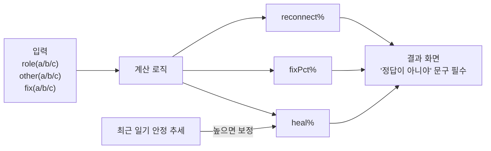
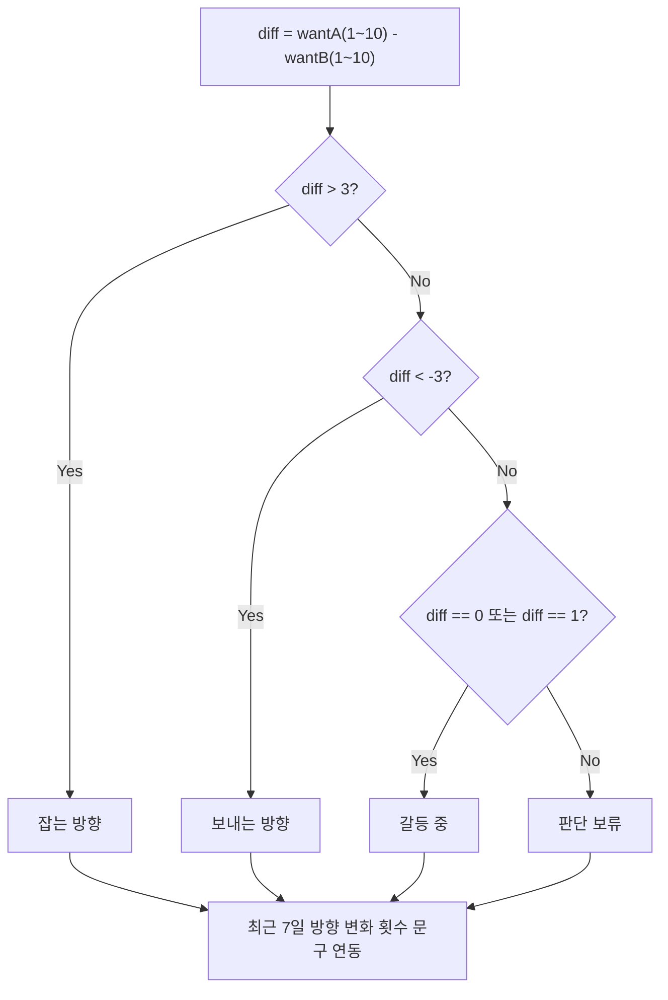
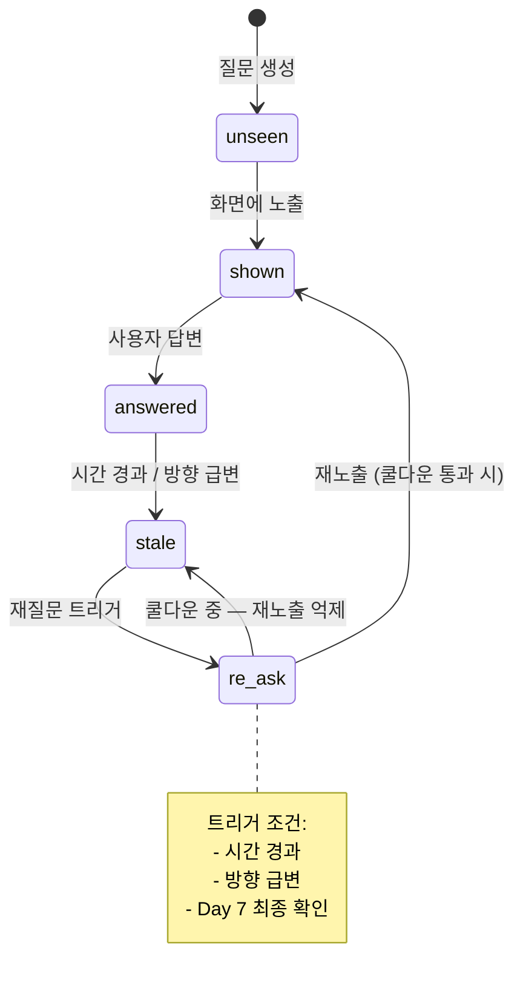

# Logic Rules

## 가망 진단 계산

## 나침반 방향 판정

## 질문 상태 머신

## 가망 진단
- 입력: `role(a/b/c) x other(a/b/c) x fix(a/b/c)`
- 출력: `reconnect%`, `fixPct%`, `heal%`
- 최근 일기 안정 추세가 높으면 `heal%` 보정
- 결과 화면에 "정답이 아니야" 문구 필수

## 나침반
- 입력: `diff = wantA(1~10) - wantB(1~10)`
- `diff > 3`: 잡는 방향
- `diff < -3`: 보내는 방향
- `|diff| <= 1`: 갈등 중
- 나머지: 판단 보류
- 최근 7일 방향 변화 횟수 문구 연동

## 질문 상태 머신
- `unseen → shown → answered → stale → re-ask`
- 재질문 트리거: 시간 경과, 방향 급변, Day 7 최종 확인
- 중복 노출 방지를 위한 쿨다운 적용
