# reason — 그날 이후 : 시스템 전체 리서치

> 작성 기준: CLAUDE.md + 전체 가이드 문서(00~09) + reason_project_v2.md 통합 분석  
> 목적: 개발 착수 전 모든 시스템의 작동 방식을 한 문서에서 파악한다

---

## 목차

1. [프로젝트 개요 & 핵심 철학](#1-프로젝트-개요--핵심-철학)
2. [전체 시스템 아키텍처](#2-전체-시스템-아키텍처)
3. [데이터베이스 스키마 상세](#3-데이터베이스-스키마-상세)
4. [공유 질문 풀 시스템](#4-공유-질문-풀-시스템)
5. [이별 일기 시스템](#5-이별-일기-시스템)
6. [졸업 유예기간 (냉각기) 시스템](#6-졸업-유예기간-냉각기-시스템)
7. [진단 & 나침반 로직](#7-진단--나침반-로직)
8. [AI / GPT 시스템](#8-ai--gpt-시스템)
9. [알림 시스템](#9-알림-시스템)
10. [상태 관리 (Zustand)](#10-상태-관리-zustand)
11. [API 설계](#11-api-설계)
12. [UX & 화면 전환 시스템](#12-ux--화면-전환-시스템)
13. [디자인 시스템](#13-디자인-시스템)
14. [폴더 구조 & 코딩 컨벤션](#14-폴더-구조--코딩-컨벤션)
15. [빌드 & 배포 파이프라인](#15-빌드--배포-파이프라인)
16. [보안 원칙](#16-보안-원칙)
17. [QA & 리스크 관리](#17-qa--리스크-관리)
18. [개발 로드맵 (Phase별)](#18-개발-로드맵-phase별)
19. [절대 규칙 체크리스트](#19-절대-규칙-체크리스트)

---

## 1. 프로젝트 개요 & 핵심 철학

### 앱 이름
**reason — 그날 이후**

### 핵심 철학
> "이 앱을 지우는 날이 진짜 졸업하는 날이야."

앱의 성공 지표는 **사용자 유지(Retention)가 아니라 이탈(졸업)**이다.  
이별을 정리한 사용자가 앱을 삭제하고 현실로 돌아가는 것이 목표.

### 타겟 사용자 (페르소나)

| 항목 | 내용 |
|------|------|
| 나이 | 27세 |
| 직업 | 백수 (취업 준비 중) |
| 상태 | 이별 직후, 감정적으로 혼란 |
| 행동 | 인스타그램·유튜브 자주 봄, 마음이 잡기↔보내기 사이에서 계속 흔들림 |
| 니즈 | 감정 정리 + 현실(취업 준비)로 돌아갈 동력 |

### 문제 정의

1. 이별 직후 감정적 혼란 속에서 혼자 정리하기 어렵다
2. 감정은 매일 바뀐다 — 잡고 싶었다가 보내고 싶었다가 반복
3. 정리되지 않은 감정이 일상·취업 집중을 방해한다
4. 기존 앱들은 트랙이 분리되어 질문이 맥락을 넘어 연결되지 않는다

### 앱이 하는 것 (전체 데이터 흐름)

```
매일의 감정 기록 (이별 일기)
        ↕ 유기적 연결 (공유 질문 풀)
공유 질문 풀 (장점/단점/이유/후회 등)
        ↕ 시간에 따른 변화 추적
결정 지원 (잡기 / 보내기 / 유보)
        ↕ 냉각 유예기간 (7일)
졸업 — 앱 삭제 or 다음 단계
```

---

## 2. 전체 시스템 아키텍처

### 레이어 구성

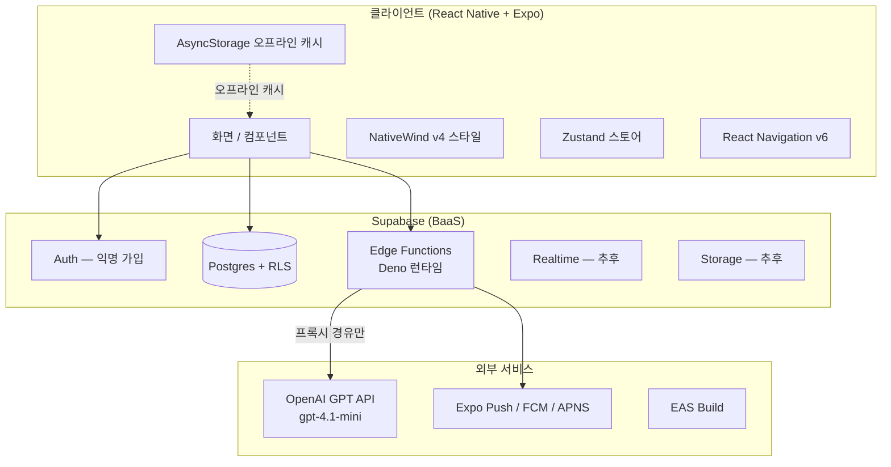

### 왜 백엔드(Supabase)가 필요한가

| 이유 | 설명 |
|------|------|
| GPT API 프록시 | `OPENAI_API_KEY`를 클라이언트에 노출 불가 — 반드시 Edge Function 경유 |
| 푸시 알림 | 졸업 유예기간 알림(Day 7), 일기 리마인더 크론잡 |
| 감정 변화 추적 | 시간에 따른 데이터 분석은 서버에서 처리 |
| 공유 질문 풀 관리 | 질문 추가/수정을 앱 업데이트 없이 서버에서 동적으로 |
| AI 응답 캐싱 | 같은 맥락 반복 호출 방지 (비용 절감) |

---

## 3. 데이터베이스 스키마 상세

모든 테이블은 **Row Level Security(RLS)** 필수. `user_id` 기준으로 각 사용자가 자신의 데이터만 접근할 수 있다.

### 3-1. users

```sql
users (
  id                       uuid PRIMARY KEY,
  created_at               timestamp,
  breakup_date             date,            -- 이별 날짜 (D+N 계산 기준)
  onboarding_completed     boolean,
  graduation_requested_at  timestamp NULL,  -- 졸업 신청 시각
  graduation_confirmed_at  timestamp NULL,  -- 졸업 확정 시각 (유예 후)
  push_token               text NULL        -- Expo Push Token
)
```

**작동 방식:**
- `breakup_date`로 D+N(이별 경과일)을 실시간 계산: `CURRENT_DATE - breakup_date`
- `graduation_requested_at`이 NULL이 아니면 유예기간 진입 상태
- `graduation_confirmed_at`이 채워지면 졸업 확정 완료

### 3-2. journal_entries (이별 일기)

```sql
journal_entries (
  id           uuid PRIMARY KEY,
  user_id      uuid FK → users,
  created_at   timestamp,
  mood_score   int CHECK (1~10),   -- 감정 온도 슬라이더 값
  mood_label   text,               -- 선택 감정 (보고싶어/화나/멍해/그리워/괜찮아/슬퍼/후회돼)
  direction    text,               -- catch | let_go | undecided
  free_text    text NULL,          -- 자유 서술
  ai_response  text NULL           -- GPT 공감 응답 (비동기로 채워짐)
)
```

**작동 방식:**
- 하루 1회 이상 작성 가능
- `direction` enum은 전역 통일: `catch | let_go | undecided` (한국어 UI 표현은 i18n 레이어에서)
- `ai_response`는 작성 직후 Edge Function 비동기 호출로 채워짐
- `/journal/today` API로 오늘 작성 여부 확인 → 홈 CTA 상태 결정

### 3-3. question_responses (공유 질문 응답)

```sql
question_responses (
  id              uuid PRIMARY KEY,
  user_id         uuid FK → users,
  question_id     text,             -- 예: "pros_comfort", "cons_communication"
  response_type   text,             -- pill_select | free_text | slider | choice
  response_value  jsonb,            -- 유연한 응답 저장 (타입별 구조 다름)
  created_at      timestamp,
  updated_at      timestamp         -- 답변 변경 시 자동 갱신 → 변화 추적 근거
)
```

**핵심 제약:**
```sql
UNIQUE (user_id, question_id)  -- 동일 질문 중복 방지
-- INSERT 시 반드시 upsert 사용:
INSERT ... ON CONFLICT (user_id, question_id) DO UPDATE SET response_value = ...
```

**response_value 예시:**
```json
// pill_select
{"selected": ["pros_comfort", "pros_laugh"]}

// free_text
{"text": "항상 내 말을 잘 들어줬어"}

// slider
{"value": 7}

// choice
{"selected": "catch"}
```

### 3-4. relationship_profile (관계 프로필 — 누적)

```sql
relationship_profile (
  id                  uuid PRIMARY KEY,
  user_id             uuid FK → users,
  pros                jsonb,  -- [{text, source_question, added_at}]
  cons                jsonb,
  breakup_reasons     jsonb,
  partner_traits      jsonb,
  my_role_reflection  jsonb,
  updated_at          timestamp
)
```

**작동 방식:**
- 관계 분석, 결정 나침반, 이별 일기에서 새로운 응답이 들어올 때마다 자동 누적
- `source_question`으로 어느 질문에서 나온 데이터인지 추적
- 각 트랙에서 데이터를 꺼내 쓸 때 이 테이블에서 읽는다

### 3-5. decision_history (결정 이력)

```sql
decision_history (
  id            uuid PRIMARY KEY,
  user_id       uuid FK → users,
  created_at    timestamp,
  direction     text,             -- catch | let_go | undecided
  confidence    int CHECK (1~10), -- 확신도
  reasoning     text NULL,
  compass_data  jsonb             -- 결정 시점의 나침반 스냅샷
)
```

**작동 방식:**
- 방향이 바뀔 때마다 새 행 삽입 (이력은 삭제하지 않음)
- `compass_data`에 해당 시점의 나침반 계산 결과를 스냅샷 저장 → 졸업 리포트 재현 가능
- 방향 변화 횟수: `COUNT(*) WHERE user_id = ? GROUP BY direction`

### 3-6. graduation_cooling (졸업 유예기간)

```sql
graduation_cooling (
  id                   uuid PRIMARY KEY,
  user_id              uuid FK → users,
  requested_at         timestamp,
  cooling_ends_at      timestamp,  -- requested_at + interval '7 days'
  status               text,       -- cooling | confirmed | cancelled
  checkin_responses    jsonb,      -- 유예기간 중 체크인 응답 배열
  notifications_sent   int DEFAULT 0  -- Day 7 알림 발송 여부 (중복 방지)
)
```

**작동 방식:**
- `status = cooling`: 유예 진행 중 (일반 알림 전면 중지)
- `status = confirmed`: 졸업 확정
- `status = cancelled`: 복귀 (체크인 데이터는 보존)
- `notifications_sent`가 1 이상이면 Day 7 알림 중복 발송 방지

### 3-7. question_pool (공유 질문 풀 — 서버 관리)

```sql
question_pool (
  id            text PRIMARY KEY,     -- 예: "pros_comfort"
  category      text,                 -- pros | cons | reason | regret | lesson | future | why_stay | why_leave
  text_ko       text,                 -- 질문 한국어 텍스트
  context       text[],               -- [analysis, compass, journal, graduation] — 노출 맥락
  display_type  text,                 -- pill | free_text | slider | choice
  options       jsonb NULL,           -- pill/choice일 때 선택지 목록
  order_weight  int,                  -- 노출 우선순위
  is_active     boolean DEFAULT true
)
```

**핵심:** 앱 업데이트 없이 서버에서 질문을 추가/수정/비활성화할 수 있다.

---

## 4. 공유 질문 풀 시스템

이 프로젝트의 핵심 혁신. 기존 앱들은 트랙(관계 분석/나침반/졸업)이 각각 독립적이어서 같은 질문을 다른 맥락에서 연결하지 못했다. 이 시스템은 그 문제를 해결한다.

### 4-1. 작동 원리

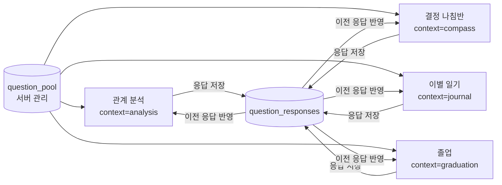

한 곳에서 답하면 다른 화면에서 자동으로 반영된다. 사용자는 같은 내용을 두 번 입력하지 않는다.

### 4-2. 질문 카테고리 & 맥락 매핑

| category | 의미 | 노출 맥락 |
|----------|------|-----------|
| `pros` | 관계의 장점 | analysis, compass, graduation |
| `cons` | 관계의 단점 | analysis, compass, journal |
| `reason` | 헤어진 이유 | analysis, compass |
| `why_stay` | 잡아야 하는 이유 | compass, journal |
| `why_leave` | 보내야 하는 이유 | compass, journal |
| `regret` | 후회 | graduation, journal |
| `lesson` | 배운 것 | graduation, report |
| `future` | 앞으로 | graduation, report |

### 4-3. 질문 상태 머신

각 질문은 사용자별로 다음 상태를 순환한다:

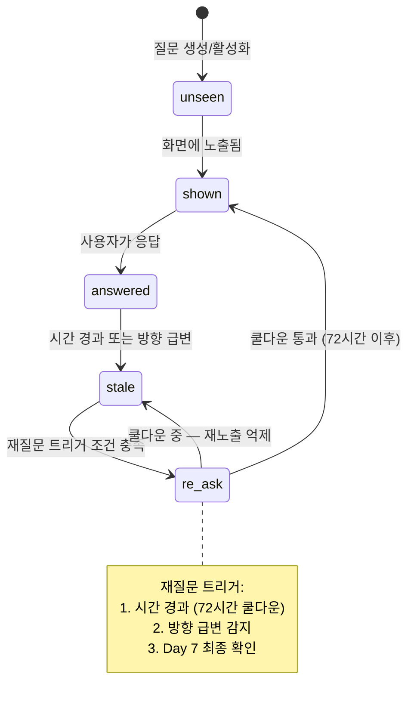

### 4-4. 유기적 연결 예시

**Day 1 — 관계 분석에서:**
> "왜 헤어졌어?" → 사용자: "대화가 줄었어" (`cons_communication` 응답)

**Day 3 — 결정 나침반에서 (같은 데이터 활용):**
> "대화가 줄었던 게 해결될 수 있을 것 같아?" → 새 질문으로 확장

**Day 6 — 이별 일기에서 (맥락형 재질문):**
> "그때 대화가 줄었다고 했잖아. 지금도 그게 가장 큰 이유야?"
> → 답이 바뀌면 `relationship_profile.cons` 자동 업데이트

**졸업 단계 — 변화 보여주기:**
> "처음에 대화 부족이 이유라고 했는데, 지금 돌아보면 어때?"
> → `updated_at` 기반으로 인식 변화 시각화

### 4-5. 질문 추천 스코어링

```
score = relevance + novelty + stability + emotional_safety
```

| 요소 | 의미 |
|------|------|
| relevance | 현재 맥락(일기 방향, 감정 온도)과 관련도 |
| novelty | 최근에 노출되지 않은 새로운 질문 우선 |
| stability | 감정이 불안정할 때는 자극적 질문 제외 |
| emotional_safety | 감정 온도 낮을 때 민감한 질문 후순위 |

---

## 5. 이별 일기 시스템

앱의 핵심 매일 루틴. 사용자가 매일 접속하는 주요 진입점이다.

### 5-1. 일기 작성 화면 흐름 (4단계)

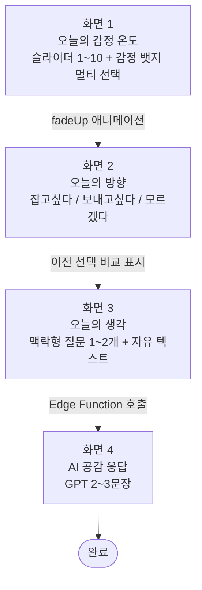

### 5-2. 감정 레이블 (mood_label)

```
보고싶어 / 화나 / 멍해 / 그리워 / 괜찮아 / 슬퍼 / 후회돼
```
멀티 선택 가능. `journal_entries.mood_label`에 콤마 구분 또는 JSON 배열로 저장.

### 5-3. 방향 분기 규칙

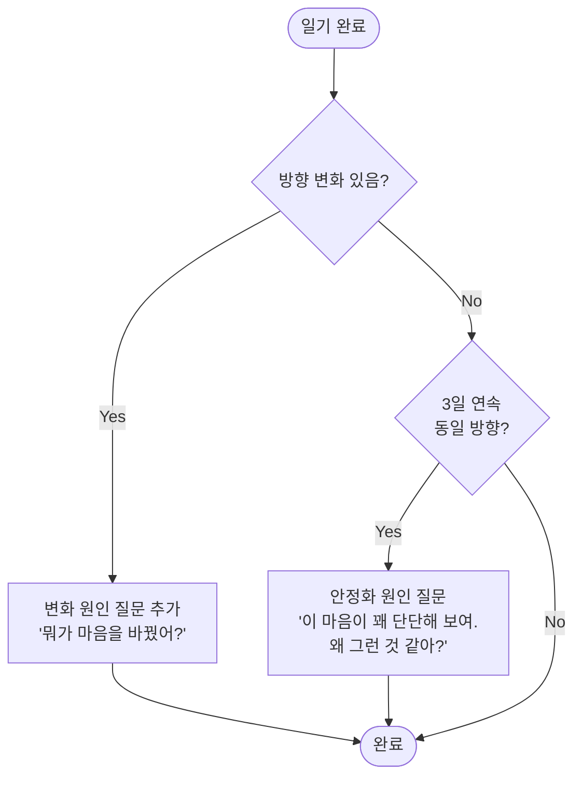

### 5-4. 일기 데이터 활용 체인

```
일기 기록 축적
    ↓
감정 온도 추이 라인 차트 (MoodChart 컴포넌트)
    ↓
관계 프로필 자동 업데이트 (새 장단점 발견 시 relationship_profile 갱신)
    ↓
결정 나침반 재진입 시 "지난 7일간 감정 변화" 표시
    ↓
졸업 리포트 — "처음 → 지금" 변화 전체 요약
```

### 5-5. 홈 화면에서의 일기 상태 표시

| 상태 | 홈 CTA 표시 |
|------|------------|
| 오늘 미작성 | "오늘 아직 안 들렀어. 잠깐 들를래?" |
| 오늘 작성 완료 | "오늘 기록 완료 ✓ + 감정 온도 표시" |

---

## 6. 졸업 유예기간 (냉각기) 시스템

### 6-1. 왜 유예가 필요한가

감정적으로 "졸업!"했다가 다음 날 후회하는 것을 방지한다. 이혼 냉각기 개념과 동일. 진짜 괜찮은지 7일간 확인한다.

### 6-2. 전체 상태 머신

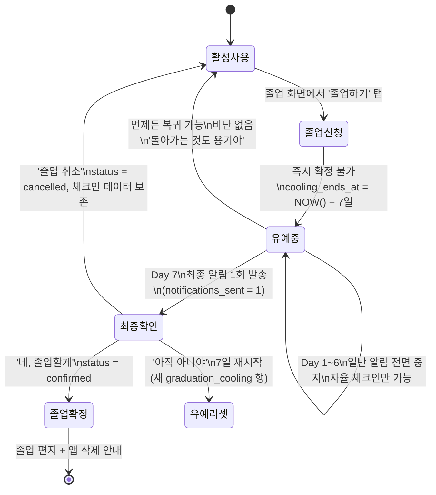

### 6-3. 유예기간 알림 타임라인

| Day | 알림 | 설명 |
|-----|------|------|
| Day 1~6 | 없음 | 감정 자극 최소화 — 리마인더도 중지 |
| Day 7 | 최종 알림 1회 | "7일이 지났어. 준비됐어?" |

**핵심 규칙:** `graduation_cooling.status = cooling` 동안 일반 알림(리마인더, 감정변화) 전면 중지.

### 6-4. 유예기간 중 체크인 화면

```
화면 1: "졸업 D-N"
"졸업까지 N일 남았어. 오늘 기분은?"
감정 온도 슬라이더 (1~10)

화면 2: "마음이 바뀌진 않았어?"
→ 졸업 의지 그대로야
→ 좀 흔들려
→ 다시 돌아가고 싶어

흔들리거나 돌아가고 싶으면:
→ "괜찮아. 돌아가는 것도 용기야." + 앱 복귀 버튼
```

체크인 응답은 `graduation_cooling.checkin_responses jsonb`에 배열로 누적.

### 6-5. 유예 리셋 vs 취소 데이터 정책

| 상황 | 처리 |
|------|------|
| 유예 리셋 (7일 재시작) | 기존 `graduation_cooling` 행을 닫고 새 행 삽입. 기존 체크인 데이터 보존. |
| 유예 취소 (앱 복귀) | `status = cancelled`. `checkin_responses` 보존. 졸업 리포트에 '취소 이력' 반영. |
| 졸업 확정 | `status = confirmed`. 모든 체크인 데이터를 졸업 리포트에 포함. |

---

## 7. 진단 & 나침반 로직

### 7-1. 가망 진단 계산

**입력값:**
```
role   = 내 역할 평가   (a / b / c)
other  = 상대 마음 평가 (a / b / c)
fix    = 극복 가능성    (a / b / c)
```

**출력값:**
```
reconnect%  = 재결합 가능성
fixPct%     = 관계 개선 가능성
heal%       = 혼자 정리 가능성
```

**보정 규칙:**
- 최근 일기 안정 추세가 높으면(감정 온도 상승 경향) `heal%` 상향 보정
- 결과 화면에 **"이건 정답이 아니야"** 문구 필수 포함

**미터 3개 UI (`MeterBar` 컴포넌트):**
```
reconnect% ████░░░░ 45%
fixPct%    ██████░░ 62%
heal%      ███████░ 73%
```

### 7-2. 결정 나침반 방향 판정

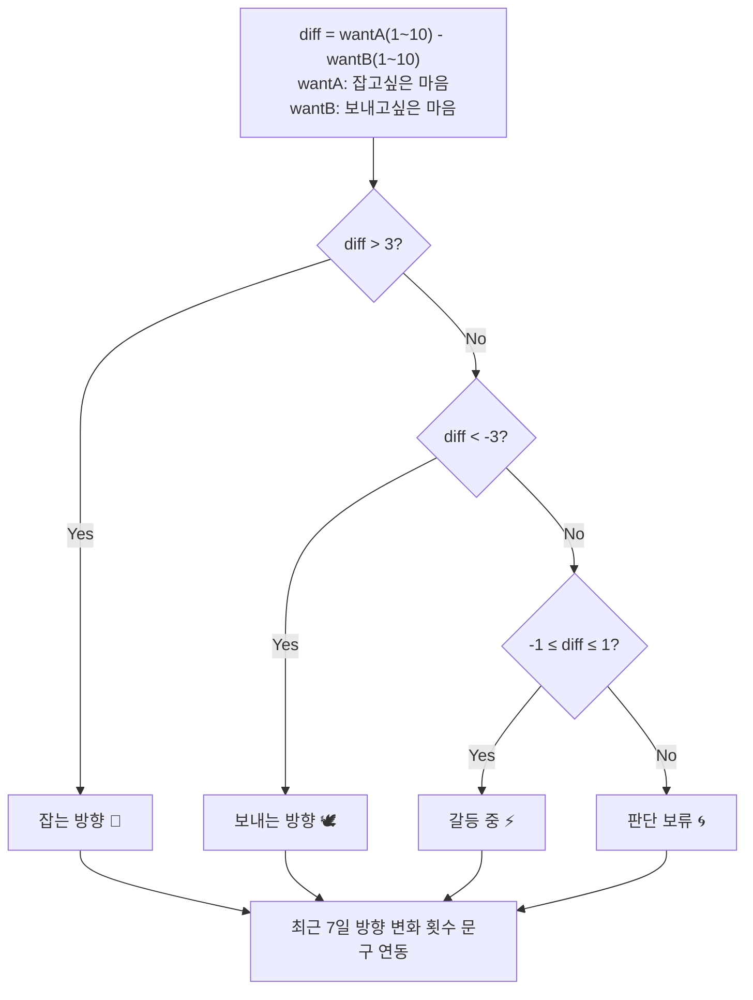

**경계값 규칙:**
| diff 범위 | 판정 |
|-----------|------|
| diff > 3 | 잡는 방향 |
| diff < -3 | 보내는 방향 |
| -1 ≤ diff ≤ 1 | 갈등 중 |
| 그 외(-3~-1, 1~3 제외 구간) | 판단 보류 |

### 7-3. 결정 나침반 화면 흐름 (5단계)

| 단계 | 내용 |
|------|------|
| Step 0 | 데이터 요약 — 관계 분석 결과 + 최근 7일 일기 추이 |
| Step 1 | 솔직한 마음 — "지금 이 순간 원하는 게 뭐야?" (이전 선택 비교) |
| Step 2 | 공유 질문 기반 이성적 체크 — why_stay/why_leave 미응답 질문 |
| Step 3 | 시나리오 — "잡는다면 / 보낸다면" |
| Step 4 | 나침반 결과 + 일기 연계 인사이트 |
| Step 5 | 행동 제안 |

---

## 8. AI / GPT 시스템

### 8-1. 호출 정책 (절대 규칙)

```
클라이언트 → Supabase Edge Function → OpenAI GPT API
```

클라이언트에서 직접 GPT 호출 절대 금지. `OPENAI_API_KEY`는 Edge Function 환경변수에만 존재.

### 8-2. 역할 분리

| 시스템 | 담당 |
|--------|------|
| 앱 로직 (TypeScript) | 가망 진단 계산, 나침반 방향 판정, 질문 상태 머신 |
| GPT | 감정 공감 문장화, 개인화 응답 생성 |

GPT는 계산하지 않고 **공감하고 문장화**한다.

### 8-3. 기본 모델

```
gpt-4.1-mini  (비용과 속도 균형)
```

### 8-4. 프롬프트 기본 컨텍스트 (모든 GPT 호출에 포함)

```
1. 사용자 이별 D+N (경과일)
2. 최근 3일 감정 온도 추이 (배열)
3. 최근 방향 변화 (catch/let_go/undecided)
4. 말투 원칙:
   - 단정/강요 금지 ("해야 해" 금지)
   - 가능성 제시
   - 비난 금지
   - 결정은 항상 사용자에게
```

### 8-5. Edge Function 목록

| 함수명 | 트리거 | 역할 |
|--------|--------|------|
| `ai-comfort/` | 온보딩 완료 후 | 초기 감정 위로 |
| `ai-journal-response/` | 일기 작성 완료 | 일기 AI 공감 응답 |
| `ai-daily-quote/` | 홈 진입 시 | 오늘의 한마디 |
| `ai-graduation-letter/` | 졸업 Step 2 | 졸업 편지 개인화 |
| `push-daily-reminder/` | 크론잡 (저녁 9시) | 일기 리마인더 푸시 |
| `push-cooling-checkin/` | 크론잡 (Day 7 체크) | 졸업 유예 최종 알림 |

### 8-6. 실패 대응 (Fallback)

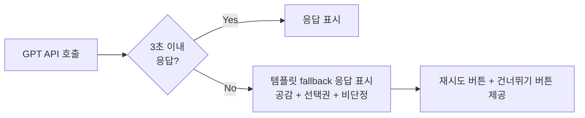

**Fallback 응답 원칙:**
- 공감 포함
- 결정 강요 금지
- 비난 금지
- 선택권 제공 ("재시도할게", "이번엔 건너뛸게")

---

## 9. 알림 시스템

### 9-1. 알림 종류 전체

| 종류 | 시점 | 내용 | 유예기간 중 |
|------|------|------|------------|
| 일기 리마인더 | 매일 저녁 9시 (조정 가능) | "오늘 하루 어땠어? 잠깐 들러." | **중지** |
| 미작성 독촉 | 3일 연속 미작성 | "요즘 어떻게 지내? 잠깐이라도." | **중지** |
| 감정 변화 | 방향 급변 감지 | "마음이 바뀐 것 같아. 괜찮아?" | **중지** |
| 안정화 알림 | 3일 연속 동일 방향 | "마음이 꽤 단단해 보여. 어떻게 생각해?" | **중지** |
| **유예 Day 7** | 졸업 신청 +7일 | "7일이 지났어. 준비됐어?" | **발송 (유일)** |

### 9-2. 알림 발송 결정 트리

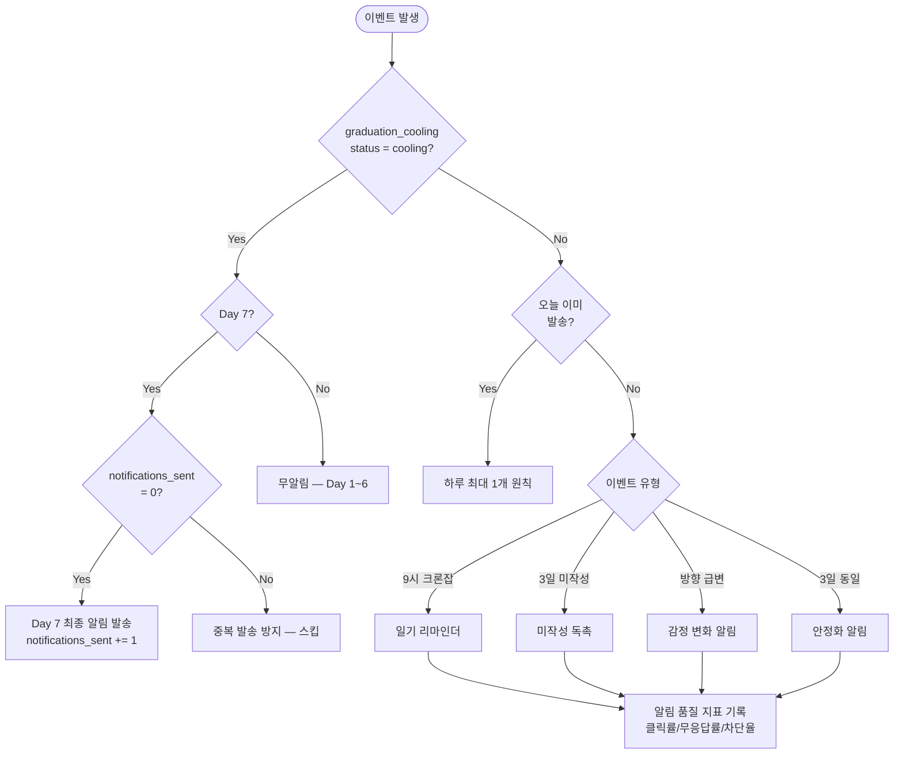

### 9-3. 알림 기술 스택

| 환경 | 기술 |
|------|------|
| 개발/테스트 | Expo Push Notifications |
| 프로덕션 | Firebase Cloud Messaging (FCM) + APNS |
| 스케줄링 | Supabase Edge Functions + pg_cron |

### 9-4. 과다 발송 방지

- **하루 최대 1개 원칙** 전역 적용
- 알림 피로 지표 모니터링:
  - 클릭률 (열어봄)
  - 무응답률 (도착했으나 무시)
  - 차단율 (알림 차단)
- 지표 기반으로 발송 빈도 자동 조정

---

## 10. 상태 관리 (Zustand)

### 10-1. 스토어 전체 구조

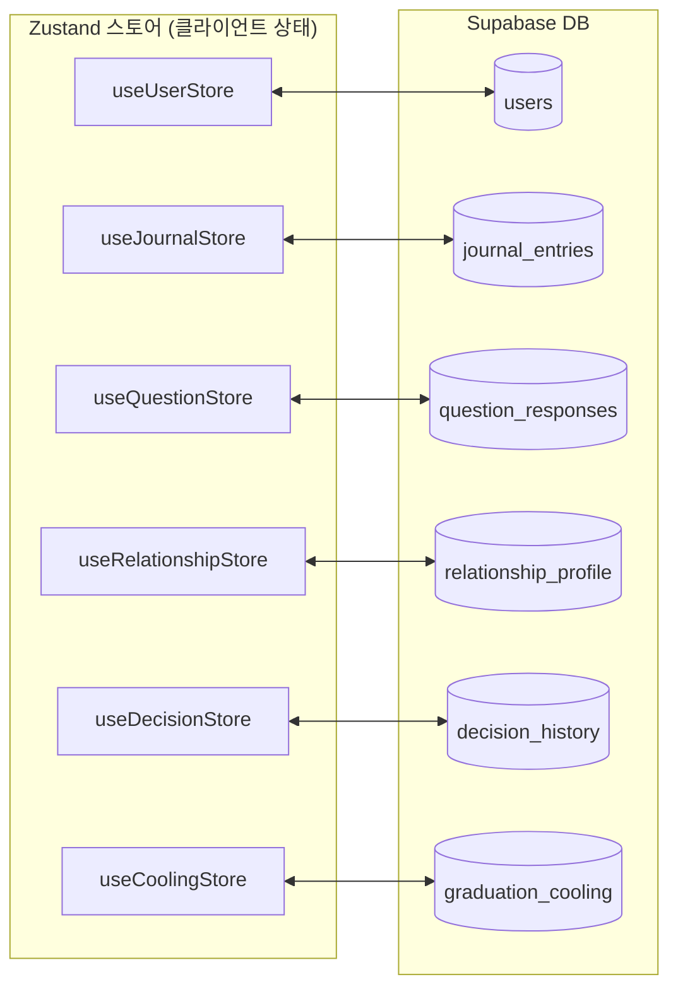

### 10-2. 스토어별 상세 책임

#### useUserStore
```typescript
{
  breakupDate: Date,        // 이별 날짜
  dPlusN: number,           // D+N 경과일 (computed)
  onboardingCompleted: boolean,
  pushToken: string | null,
  // actions
  setBreakupDate, setOnboardingCompleted, setPushToken
}
```

#### useJournalStore
```typescript
{
  todayEntry: JournalEntry | null,   // 오늘 일기
  entries: JournalEntry[],           // 전체 목록
  stats: {
    moodHistory: number[],           // 감정 온도 배열
    directionHistory: Direction[],   // 방향 이력
    totalDays: number
  },
  // actions
  addEntry, updateEntry, loadEntries
}
```

#### useQuestionStore
```typescript
{
  pool: Question[],                  // 전체 질문 풀 (서버에서 로드)
  responses: QuestionResponse[],     // 내 응답 전체
  // actions
  loadPool, respond, updateResponse,
  getByContext: (ctx: Context) => Question[],  // 맥락별 필터
  getUnAnswered: () => Question[]
}
```

#### useRelationshipStore
```typescript
{
  pros: Trait[],
  cons: Trait[],
  breakupReasons: Reason[],
  partnerTraits: Trait[],
  myRoleReflection: Reflection[],
  // actions
  addPro, addCon, updateProfile
}
```

#### useDecisionStore
```typescript
{
  history: Decision[],
  latest: Decision | null,
  // actions
  recordDecision, loadHistory
}
```

#### useCoolingStore
```typescript
{
  status: 'none' | 'cooling' | 'confirmed' | 'cancelled',
  requestedAt: Date | null,
  coolingEndsAt: Date | null,
  daysRemaining: number,           // computed
  checkins: Checkin[],
  notificationsSent: number,
  // actions
  startCooling, submitCheckin, confirm, cancel, reset
}
```

---

## 11. API 설계

### 11-1. 인증

```
POST /auth/signup   — 익명 가입 (Supabase Auth)
POST /auth/login    — 로그인
```

### 11-2. 사용자

```
GET  /user/profile      — 프로필 조회 (이별 날짜, D+N)
PUT  /user/profile      — 프로필 수정
PUT  /user/push-token   — 푸시 토큰 등록
```

### 11-3. 이별 일기

```
POST /journal              — 일기 작성
GET  /journal              — 일기 목록 (페이지네이션)
GET  /journal/today        — 오늘 일기 조회
GET  /journal/stats        — 감정 추이, 방향 변화 통계
GET  /journal/:id          — 특정 일기 상세
```

### 11-4. 공유 질문 풀

```
GET  /questions?context=analysis   — 맥락별 질문 목록
GET  /questions/responses          — 내 응답 전체
POST /questions/respond            — 질문 응답 (upsert)
PUT  /questions/respond/:id        — 응답 수정
```

### 11-5. 관계 프로필

```
GET  /relationship/profile    — 누적 프로필
GET  /relationship/changes    — 시간에 따른 변화 이력
```

### 11-6. 결정

```
POST /decision           — 결정 기록
GET  /decision/history   — 결정 이력 전체
GET  /decision/latest    — 최신 결정
```

### 11-7. AI 응답 (Edge Function 프록시)

```
POST /ai/comfort            — 감정 위로 응답 생성
POST /ai/daily-quote        — 오늘의 한마디
POST /ai/journal-response   — 일기 AI 응답
POST /ai/graduation-letter  — 졸업 편지 개인화
```

### 11-8. 졸업

```
POST /graduation/request    — 졸업 신청 (유예기간 시작)
GET  /graduation/status     — 현재 상태
POST /graduation/checkin    — 유예기간 체크인
POST /graduation/confirm    — 졸업 확정
POST /graduation/cancel     — 졸업 취소 (복귀)
```

---

## 12. UX & 화면 전환 시스템

### 12-1. 핵심 UX 원칙

**채팅 UI 완전 금지.** 화면 단위 질문-응답 전환만 허용.

- 질문이 화면 전체를 채운다
- 선택/입력 후 다음 화면으로 전환
- 모든 화면 전환에 `fadeUp` 애니메이션 적용

### 12-2. fadeUp 애니메이션 구현

```typescript
// opacity + translateY 조합
Animated.parallel([
  Animated.timing(opacity, {
    toValue: 1,
    duration: 300,
    useNativeDriver: true,
  }),
  Animated.timing(translateY, {
    toValue: 0,
    duration: 300,
    useNativeDriver: true,
  }),
]).start()
```

### 12-3. 전체 유저 플로우

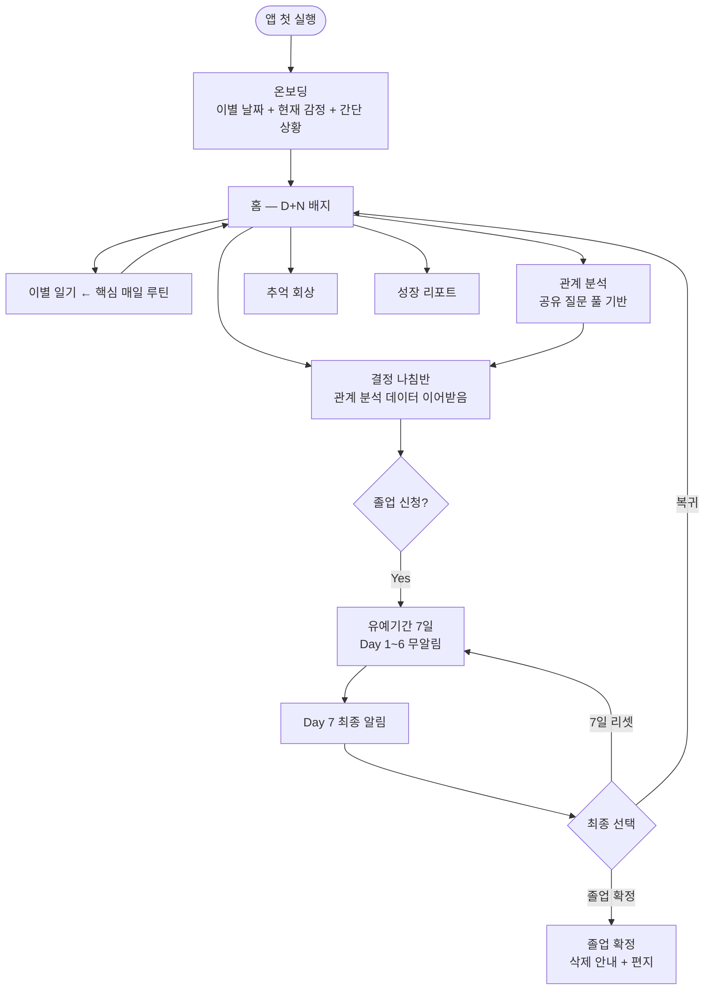

### 12-4. 유기적 연결 원칙

| 원칙 | 구현 |
|------|------|
| 이전 답변 재노출 | "저번에 이렇게 말했는데" 프레임 + `question_responses.updated_at` |
| 답변 변화 감지 | 새 응답 ≠ 기존 응답이면 "마음이 바뀐 것 같아" 문구 |
| 양쪽 비교 | 장단점, 잡아야/보내야 이유를 한 화면에서 동시 표시 |
| 크로스 트랙 | 일기에서 답한 내용이 관계 분석/나침반에 자동 반영 |

---

## 13. 디자인 시스템

### 13-1. 컬러 팔레트

| 이름 | 메인 색상 | 용도 |
|------|----------|------|
| Purple | `#534AB7` | Primary — 관계 분석, 메인 액센트 |
| Teal | `#1D9E75` | 긍정/성장 — 감정 위로, 잡기 방향 |
| Coral | `#993C1D` | 경고/주의 — 힘든 감정 |
| Pink | `#D4537E` | 감정 정리 필요 — 보내기 방향 |
| Amber | `#BA7517` | 판단 보류 — 추억, 갈등 |
| Gray | `#888780` | 중립 — 보조, 미결정 |

**컬러 토큰 상세:**
```
Purple: 50:#EEEDFE / 400:#7F77DD / 600:#534AB7 / 800:#3C3489
Teal:   50:#E1F5EE / 400:#1D9E75 / 600:#0F6E56 / 800:#085041
Coral:  50:#FAECE7 / 400:#D85A30 / 600:#993C1D / 800:#712B13
Pink:   50:#FBEAF0 / 400:#D4537E / 600:#993556 / 800:#72243E
Amber:  50:#FAEEDA / 400:#BA7517 / 600:#854F0B / 800:#633806
Gray:   50:#F1EFE8 / 400:#888780 / 600:#5F5E5A / 800:#444441
```

### 13-2. 타이포그래피

| 용도 | 크기 | 굵기 |
|------|------|------|
| 큰 질문 | 20~22px | 500 |
| 본문 | 14px | 400 |
| 보조 | 13px | 400 + secondary color |
| 레이블 | 11px | 500 + letter-spacing 0.5px |

### 13-3. 컴포넌트 목록

**기존 컴포넌트:**
```
InsightCard / ChoiceButton / Pill / MeterBar / ProgressDots / PrimaryButton / Compass
```

**신규 컴포넌트:**

| 컴포넌트 | 역할 |
|----------|------|
| `MoodSlider` | 감정 온도 1~10 슬라이더 |
| `DirectionPicker` | 잡기/보내기/모름 3버튼 + 이전 선택 표시 |
| `ChangeIndicator` | "어제: 잡고싶다 → 오늘: 보내고싶다" 변화 표시 |
| `MoodChart` | 감정 온도 추이 라인 차트 (react-native-chart-kit) |
| `CoolingTimer` | 졸업 유예기간 D-N 카운트다운 |

---

## 14. 폴더 구조 & 코딩 컨벤션

### 14-1. 폴더 구조

```
reason/
├── app/                        # Expo Router 기반 화면
│   ├── (tabs)/
│   │   ├── index.tsx           # 홈
│   │   └── report.tsx          # 성장 리포트
│   ├── onboarding/index.tsx
│   ├── journal/
│   │   ├── index.tsx           # 오늘 일기 작성
│   │   ├── history.tsx         # 일기 목록
│   │   └── detail.tsx
│   ├── analysis/
│   │   ├── index.tsx           # 통합 분석
│   │   ├── pros-cons.tsx       # 장단점 동시 입력
│   │   ├── stay-leave.tsx      # 만나야/안만나야 동시
│   │   ├── role-partner.tsx    # 내역할+상대마음
│   │   └── result.tsx          # 가망 진단
│   ├── compass/
│   │   ├── index.tsx           # 데이터 요약
│   │   ├── want.tsx            # 솔직한 마음
│   │   ├── check.tsx           # 공유 질문 체크
│   │   ├── scenario.tsx
│   │   ├── needle.tsx          # 나침반 결과
│   │   └── action.tsx          # 행동 제안
│   ├── memory/                 # 추억 회상
│   ├── graduation/
│   │   ├── report.tsx          # 성장 리포트 (일기 기반)
│   │   ├── letter.tsx          # 나에게 쓰는 편지
│   │   ├── confirm.tsx
│   │   ├── ritual.tsx
│   │   └── request.tsx         # 졸업 신청 → 유예 시작
│   └── cooling/
│       ├── index.tsx           # 유예 상태 대시보드
│       ├── checkin.tsx         # 체크인
│       └── final.tsx           # Day 7 최종 확정
│
├── components/
│   ├── ui/                     # 재사용 컴포넌트 (PascalCase)
│   └── layout/
│       ├── ScreenWrapper.tsx
│       └── StepLabel.tsx
│
├── store/                      # Zustand 스토어
│   ├── useUserStore.ts
│   ├── useJournalStore.ts
│   ├── useQuestionStore.ts
│   ├── useRelationshipStore.ts
│   ├── useDecisionStore.ts
│   └── useCoolingStore.ts
│
├── api/                        # API 클라이언트 (camelCase)
│   ├── supabase.ts
│   ├── journal.ts
│   ├── questions.ts
│   ├── relationship.ts
│   ├── decision.ts
│   ├── graduation.ts
│   └── ai.ts
│
├── hooks/                      # 커스텀 훅 (use prefix)
│   ├── useAuth.ts
│   ├── usePushNotifications.ts
│   └── useSmartQuestion.ts     # 맥락형 질문 추천 로직
│
├── utils/
│   ├── diagnosis.ts            # 가망 진단 계산
│   ├── dateUtils.ts            # D+N 계산 등
│   └── moodAnalysis.ts         # 감정 추이 분석
│
├── constants/
│   ├── colors.ts               # 디자인 시스템 컬러 토큰
│   ├── typography.ts
│   └── questionPool.ts         # 초기 질문 풀 시드 데이터
│
└── supabase/
    ├── migrations/             # DB 마이그레이션 SQL
    ├── functions/              # Edge Functions (Deno)
    │   ├── ai-comfort/
    │   ├── ai-journal-response/
    │   ├── ai-daily-quote/
    │   ├── ai-graduation-letter/
    │   ├── push-daily-reminder/
    │   └── push-cooling-checkin/
    └── seed.sql                # 질문 풀 초기 데이터
```

### 14-2. 파일 네이밍 컨벤션

| 유형 | 규칙 | 예시 |
|------|------|------|
| 화면 (Screen) | PascalCase | `HomeScreen.tsx` |
| 컴포넌트 | PascalCase | `InsightCard.tsx`, `MoodSlider.tsx` |
| 커스텀 훅 | `use` prefix + camelCase | `useSmartQuestion.ts` |
| API 모듈 | camelCase | `journal.ts`, `questions.ts` |
| Edge Function | kebab-case 폴더 | `ai-journal-response/` |
| Zustand 스토어 | `use` prefix + camelCase | `useJournalStore.ts` |
| 유틸 | camelCase | `moodAnalysis.ts` |

### 14-3. TypeScript 규칙

- `strict: true` 필수
- `any` 타입 금지
- `direction` enum: `'catch' | 'let_go' | 'undecided'`
- `graduation status` enum: `'cooling' | 'confirmed' | 'cancelled'`
- UI 문구는 i18n 레이어에서 변환 (enum과 UI 표현 분리)

### 14-4. DB 정합성 필수 규칙

```typescript
// question_responses — 반드시 upsert
await supabase
  .from('question_responses')
  .upsert(
    { user_id, question_id, response_value },
    { onConflict: 'user_id,question_id' }
  )

// direction enum — 영어 값만 저장, UI 변환은 별도
const directionLabel = {
  catch: '잡고 싶다',
  let_go: '보내고 싶다',
  undecided: '모르겠다',
}
```

---

## 15. 빌드 & 배포 파이프라인

### 15-1. 개발 서버

```bash
npx expo start            # Metro 번들러 + QR
npx expo start --ios      # iOS 시뮬레이터
npx expo start --android  # Android 에뮬레이터
```

### 15-2. 타입 체크

```bash
npx tsc --noEmit          # TypeScript 오류 확인 (CI 필수)
```

### 15-3. Supabase

```bash
supabase db push                          # 마이그레이션 적용
supabase functions deploy <function-name> # Edge Function 배포
supabase functions serve                  # 로컬 테스트
```

### 15-4. 프로덕션 빌드 (EAS)

```bash
eas build --platform ios      # iOS 빌드
eas build --platform android  # Android 빌드
eas submit                    # 앱스토어 제출
```

### 15-5. 인프라 구성

| 서비스 | 역할 |
|--------|------|
| Supabase | DB + Auth + Edge Functions + 호스팅 |
| Expo EAS | 앱 빌드 + 배포 |
| Expo Push → FCM/APNS | 푸시 알림 |
| pg_cron | 일기 리마인더 + 유예 체크 크론잡 |

---

## 16. 보안 원칙

### 16-1. API 키 보안

| 규칙 | 방법 |
|------|------|
| `OPENAI_API_KEY` 클라이언트 노출 금지 | Edge Function 환경변수에만 저장 |
| Supabase Anon Key | 클라이언트에 사용 가능 (RLS로 제한) |
| Service Role Key | 절대 클라이언트 노출 금지 |

### 16-2. Row Level Security (RLS)

모든 테이블에 적용 필수:
```sql
-- 예시 정책 (모든 테이블에 동일하게 적용)
CREATE POLICY "user_isolation"
ON journal_entries
FOR ALL
USING (auth.uid() = user_id);
```

### 16-3. DB 변경 정책

- 모든 스키마 변경은 `supabase/migrations/` SQL 파일로 관리
- 마이그레이션 번호 순서 유지
- 직접 Supabase 대시보드 수정 금지

---

## 17. QA & 리스크 관리

### 17-1. 핵심 리스크

| 리스크 | 영향 | 대응 |
|--------|------|------|
| 진단 경계값 명세 미흡 | 결과 일관성 저하 | 가중치/산식 고정 문서화 |
| 질문 재노출 규칙 부재 | UX 피로도 증가 | 72시간 쿨다운 + 상태머신 |
| enum 혼용 | 데이터 해석 오류 | 전역 enum 통일 (영어값) |
| 유예 리셋/취소 데이터 정책 미정 | 졸업 리포트 왜곡 | 체크인 데이터 보존 정책 명시 |
| GPT 실패/타임아웃 | 사용자 이탈 | 템플릿 fallback + 재시도 UX |

### 17-2. 필수 QA 시나리오

| 시나리오 | 검증 포인트 |
|----------|------------|
| 방향 급변 케이스 | catch → let_go 전환 시 질문 재노출 트리거 |
| 3일 연속 동일 방향 | 안정화 알림 발송 + 안정화 원인 질문 추가 |
| 유예 리셋 케이스 | 기존 체크인 데이터 보존 여부 |
| 유예 취소/복귀 케이스 | `status = cancelled` + 데이터 보존 |
| 유예 재신청 케이스 | 새 `graduation_cooling` 행 생성 |
| GPT 실패/타임아웃 | fallback 응답 표시 + 재시도 버튼 |
| 오프라인 상태 | AsyncStorage 캐시 기반 동작 |

### 17-3. 운영 KPI

| 지표 | 측정 방법 |
|------|----------|
| 일기 7일 유지율 | `journal_entries` 작성 빈도 분석 |
| 유예 완주율 | `graduation_cooling` status 분포 |
| 유예 중 복귀율 | `status = cancelled` / 전체 cooling |
| 졸업 확정률 | `status = confirmed` / 전체 신청 |
| 알림 클릭률 | 푸시 발송 대비 앱 진입 비율 |
| 알림 차단율 | 차단 이벤트 / 전체 발송 |

---

## 18. 개발 로드맵 (Phase별)

```mermaid
gantt
  title reason 개발 로드맵
  dateFormat  X
  axisFormat Phase %s

  section Phase 0 인프라
  Expo 프로젝트 세팅         : 0, 1
  Supabase 세팅 + DB 스키마  : 0, 1
  디자인 시스템              : 0, 1

  section Phase 1 핵심 루프
  온보딩 + 홈                : 1, 2
  이별 일기 (핵심 루틴)      : 1, 2
  Supabase Auth + 일기 CRUD : 1, 2

  section Phase 2 분석
  공유 질문 풀 시스템        : 2, 3
  관계 분석 트랙             : 2, 3
  결정 나침반 트랙           : 2, 3

  section Phase 3 AI
  GPT Edge Function         : 3, 4
  일기 AI 응답              : 3, 4
  오늘의 한마디             : 3, 4

  section Phase 4 졸업
  성장 리포트 (차트)         : 4, 5
  졸업 화면 + 유예기간       : 4, 5
  푸시 알림                 : 4, 5

  section Phase 5 다듬기
  오프라인 캐시             : 5, 6
  감정 변화 감지 알림        : 5, 6
  에러 핸들링               : 5, 6
  앱스토어 배포 준비         : 5, 6
```

| Phase | 내용 | 결과물 |
|-------|------|--------|
| 0 | 인프라 / DB / 디자인 시스템 | Supabase 세팅, 컬러/컴포넌트 시스템 |
| 1 | 온보딩 / 홈 / 이별 일기 / Auth | 핵심 매일 루틴 동작 |
| 2 | 공유 질문 풀 / 관계 분석 / 나침반 | 데이터 유기적 연결 동작 |
| 3 | GPT Edge Function / AI 응답 | 감정 공감 응답 동작 |
| 4 | 졸업 / 유예기간 / 푸시 알림 | 전체 핵심 루프 완성 |
| 5 | 오프라인 / 에러 / 배포 | 앱스토어 출시 |

---

## 19. 절대 규칙 체크리스트

개발 매 작업 시작 전 이 목록을 확인한다. **하나라도 위반 시 즉시 수정.**

| # | 규칙 | 확인 |
|---|------|------|
| 1 | 채팅 UI 사용 없음 — 화면 전환형 질문 UX만 | ☐ |
| 2 | GPT API 클라이언트 직접 호출 없음 | ☐ |
| 3 | `OPENAI_API_KEY` Edge Function 환경변수에만 존재 | ☐ |
| 4 | 모든 테이블 RLS 적용 (`user_id` 기준) | ☐ |
| 5 | 졸업 즉시 확정 없음 — 7일 유예 후 확정 | ☐ |
| 6 | 유예기간 Day 1~6 일반 알림 없음 | ☐ |
| 7 | 유예기간 Day 7 최종 알림 1회만 (중복 방지) | ☐ |
| 8 | 진단/나침반 결과에 "정답이 아니야" 문구 포함 | ☐ |
| 9 | 방향 변화에 비난/판단 문구 없음 | ☐ |
| 10 | D+N 전역 표시 항상 유지 | ☐ |
| 11 | `question_responses` — `(user_id, question_id)` unique + upsert | ☐ |
| 12 | `direction` enum: `catch \| let_go \| undecided` 영어값으로 통일 | ☐ |
| 13 | DB 변경 `supabase/migrations/` SQL 파일로만 관리 | ☐ |
| 14 | GPT 실패 시 템플릿 fallback 응답 제공 | ☐ |
| 15 | 모든 화면 전환 `fadeUp` 애니메이션 적용 | ☐ |

---

*이 문서는 CLAUDE.md + docs/guide/00~09 + docs/reason_project_v2.md를 통합 분석하여 작성되었습니다.*  
*개발 중 정책 변경 시 이 문서도 동시 업데이트가 필요합니다.*
